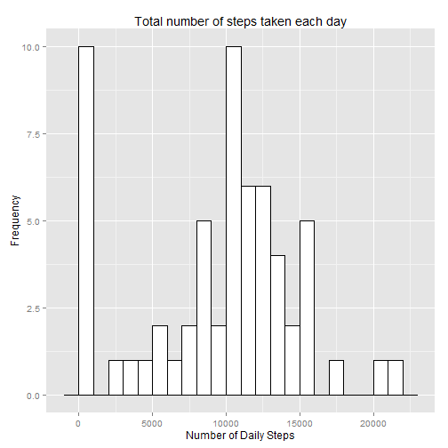
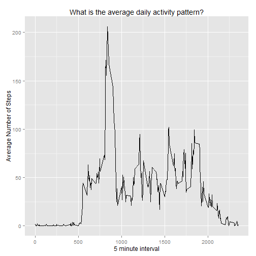
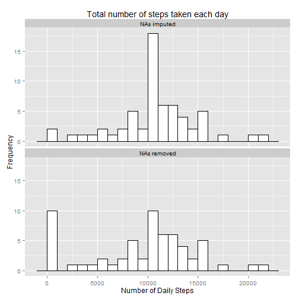
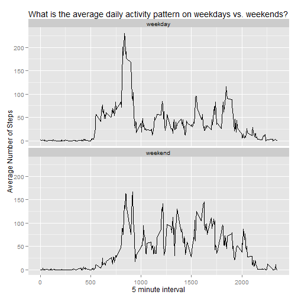

###Loading and preprocessing the data

Show any code that is needed to 
* Load the data (i.e. read.csv())
* Process/transform the data (if necessary) into a format suitable for your analysis


```r
require(ggplot2)
require(plyr)
setwd("C:\\Users\\Greg Sanders\\Documents\\Development\\RepData_PeerAssessment1")
activity<-read.csv("activity.csv")
activity$date<-strptime(activity$date,"%Y-%m-%d")
```

###What is mean total number of steps taken per day?

For this part of the assignment, you can ignore the missing values in the dataset.

Make a histogram of the total number of steps taken each day


```r
ActivityPerDay<-ddply(activity
                      ,.(date)
                      ,summarize
                      ,steps=sum(steps,na.rm=TRUE)
                      )

ggplot(
        data=ActivityPerDay
        ,aes_string(x=.(steps)
                    )
        )+
        ylab("Frequency")+
        xlab("Number of Daily Steps")+
        ggtitle("Total number of steps taken each day")+ geom_histogram(
                        binwidth=1000
                , colour="black"
                , fill="white"
                )
```

 

###Calculate and report the mean and median total number of steps taken per day


```r
stepsmean<-mean(ActivityPerDay$steps,na.rm=TRUE)
stepsmedian<-median(ActivityPerDay$steps,na.rm=TRUE)
```
* The mean number of steps per day is 9354.2295082
* The median number of steps per day is 10395


###What is the average daily activity pattern?

Make a time series plot (i.e. type = "l") of the 5-minute interval (x-axis) and the average number of steps taken, averaged across all days (y-axis)


```r
ActivityPerInterval<-ddply(activity
                           ,.(interval)
                           ,summarize
                           ,avgsteps=mean(steps,na.rm=TRUE)
                           )

ggplot(
        data=ActivityPerInterval
        ,aes_string(x=.(interval)
                    ,y=.(avgsteps)
                    )
        )+
        ylab("Average Number of Steps")+
        xlab("5 minute interval")+
        ggtitle("What is the average daily activity pattern?")+ geom_line(
                #         binwidth=1
                #         , colour="black"
                #         , fill="white"
                )
```

 


###Which 5-minute interval, on average across all the days in the dataset, contains the maximum number of steps?

```r
maxinterval<-ActivityPerInterval$interval[max(ActivityPerInterval$avgsteps)==ActivityPerInterval$avgsteps]
```
* On average across all the days in the dataset, the 835 interval contains the maximum number of steps.

###Imputing missing values

Note that there are a number of days/intervals where there are missing values (coded as NA). The presence of missing days may introduce bias into some calculations or summaries of the data.

Calculate and report the total number of missing values in the dataset (i.e. the total number of rows with NAs)

Devise a strategy for filling in all of the missing values in the dataset. The strategy does not need to be sophisticated. For example, you could use the mean/median for that day, or the mean for that 5-minute interval, etc.

*My strategy*: I used the mean for that 5-minute interval. I thought that might be more accurate than the average for the day, because there's a lot of variability from interval to interval. So if you only had late evening reports on a given day, it probably would not be appropriate to imput that for the entirity of the day including more active hours.

Create a new dataset that is equal to the original dataset but with the missing data filled in.


```r
iactivity<-activity
for (i in seq_along(ActivityPerInterval$interval)){
        fillin<-ActivityPerInterval$avgstep[[i]]
        inter<-ActivityPerInterval$interval[[i]]
        iactivity$steps[is.na(iactivity$steps)&iactivity$interval==inter]<-fillin
        }
```

###What is mean total number of steps taken per day with gaps imputed?

Make a histogram of the total number of steps taken each day. 


```r
iActivityPerDay<-ddply(iactivity
                       ,.(date)
                       ,summarize
                       ,steps=sum(steps)
                       )

iActivityPerDay$imputed<-"NAs imputed"
ActivityPerDay$imputed<-"NAs removed"
joint<-rbind(iActivityPerDay,ActivityPerDay)
joint$imputed<-factor(joint$imputed)
ggplot(
        data=joint
        ,aes_string(x=.(steps)
                    )
        )+
        ylab("Frequency")+
        xlab("Number of Daily Steps")+
        ggtitle("Total number of steps taken each day")+ geom_histogram(
                        binwidth=1000
                , colour="black"
                , fill="white"
                )+facet_wrap(  ~ imputed ,ncol=1)
```

 

Calculate and report the mean and median total number of steps taken per day. Do these values differ from the estimates from the first part of the assignment? 


```r
istepsmean<-mean(iActivityPerDay$steps,na.rm=TRUE)
istepsmedian<-median(iActivityPerDay$steps,na.rm=TRUE)
```

* The mean number of steps per day went from 9354.2295082 to 1.0766189 &times; 10<sup>4</sup> after imputing.
* The median number of steps per day went from 10395 to 1.0766189 &times; 10<sup>4</sup> after imputing.


### What is the impact of imputing missing data on the estimates of the total daily number of steps?

*My answer:* Both the median and the mean shifted upwards, with a larger shift in the mean. This was driven by a dramatic reduction in the number of days with an average of 0 to 1000 steps. After impution there is a spike in days with 10,000 to 11,000 daily steps. The pattern of this change suggests that many of the days with NAs were either predominently missing or missing in their entirity. 

## Are there differences in activity patterns between weekdays and weekends?

For this part the weekdays() function may be of some help here. Use the dataset with the filled-in missing values for this part.

Create a new factor variable in the dataset with two levels -- "weekday" and "weekend" indicating whether a given date is a weekday or weekend day.


```r
iactivity$isWeekday<-NA
iactivity$isWeekday[weekdays(iactivity$date) %in% c("Sunday","Saturday")] <-"weekend"
iactivity$isWeekday[weekdays(iactivity$date) %in% c("Monday", "Tuesday","Wednesday","Thursday","Friday")
                    ]<-"weekday"

iactivity$isWeekday<-factor(iactivity$isWeekday)

iActivityPerInterval<-ddply(iactivity
                           ,.(interval,isWeekday)
                           ,summarize
                           ,avgsteps=mean(steps,na.rm=TRUE)
                           )
```


Make a panel plot containing a time series plot (i.e. type = "l") of the 5-minute interval (x-axis) and the average number of steps taken, averaged across all weekday days or weekend days (y-axis). 


```r
ggplot(
        data=iActivityPerInterval
        ,aes_string(x=.(interval)
                    ,y=.(avgsteps)
                    )
        )+
        ylab("Average Number of Steps")+
        xlab("5 minute interval")+
        ggtitle("What is the average daily activity pattern on weekdays vs. weekends?")+ geom_line(
                #         binwidth=1
                #         , colour="black"
                #         , fill="white"
                )+facet_wrap(  ~ isWeekday ,ncol=1)
```

 


